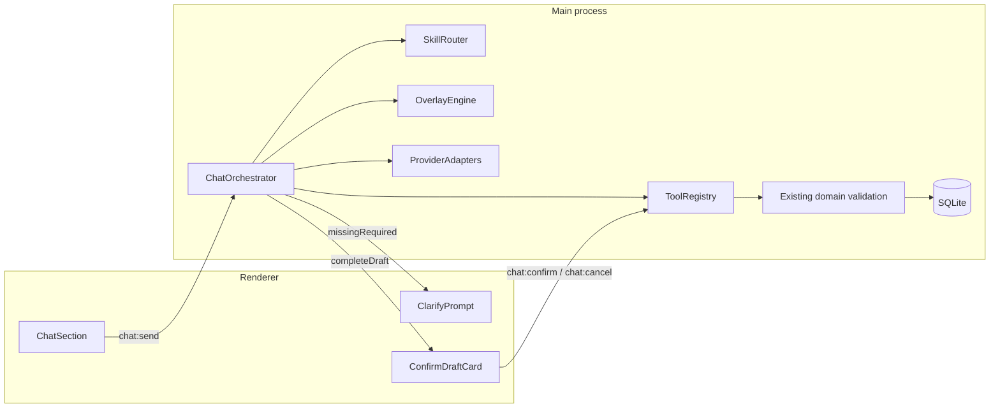
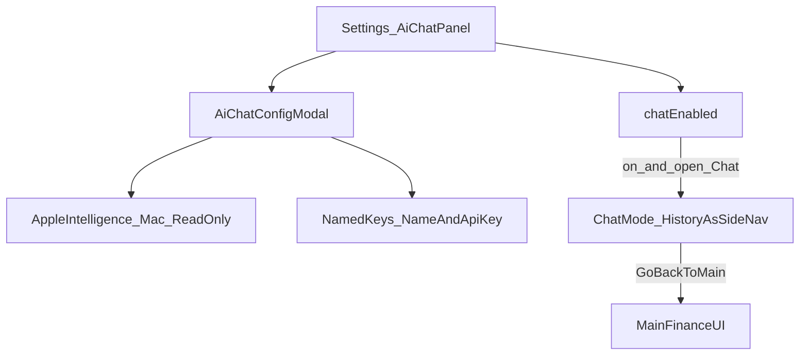

# Chat Agent Design (Finance Copilot)

Design for a **Chat** section in Notable Finance App that answers questions from local finance data and proposes create/edit mutations — never delete — with a confirm-before-write UX.

**Status:** Phase **6.6 complete** (2026-07-24) — Finance Copilot through hardening (allowlist / confirm gates / profiles / Apple read-only). Checklist: [`development-plan.md`](development-plan.md).

**Companion catalog:** skills, overlays, and clarify/refuse playbooks → [`chat-skills-and-overlays.md`](chat-skills-and-overlays.md).

## Phase 6.0 acceptance (frozen)

| Criterion | Met |
| --- | --- |
| Architecture + provider Hybrid C + confirm-before-write documented | Yes |
| Chat mode UX (history as side nav, Go Back to Main) documented | Yes |
| Configure AI: Enable Chat + Name/API Key multi-credentials + Apple Mac prefs | Yes |
| Chat history persist + deletable (not finance delete) | Yes |
| Expense profiles (base/CC/Pasabuy) + expense view scopes | Yes |
| All workflows: Transfer, CC Payment, Alkansya, Receivables | Yes |
| Skills catalog incl. `monitoring-summary`, `rebudget` (no write), refuse-delete | Yes |
| Overlays / slash modes catalog | Yes |
| Linked from desktop README + development plan Phase 6 | Yes |

### Defaults locked for 6.1 (formerly “open”)

| Topic | Locked default |
| --- | --- |
| Open Chat from Main | Sidebar **Chat** item (System group) when `chatEnabled`; enters Chat mode |
| Model picker v1 | Curated common ids + free-text “Custom…” (no live list-models API required) |
| Celebrate / tipid thresholds | Income ≥ ₱10,000; expense ≥ ₱5,000 (settings later) |
| Context window | Last **20** turns + system; truncate older |
| Mass-edit cap | **50** rows |
| Chat off vs history | History **retained**; no AI calls while off |

## Locked decisions

| Decision | Choice | Why |
| --- | --- | --- |
| Provider strategy | **Hybrid (C)** — BYOK everywhere for agentic work; Apple Intelligence Mac-only for light Q&A, **not** for writes | Electron cannot reliably drive Apple on-device models as a full tool-calling agent; BYOK (and optional local Ollama) is the practical path for parse → tools → confirm → write |
| Write safety | **Confirm** — AI proposes a draft; user Approve / Edit / Cancel | Finance mutations must not trust the model alone; main-process allowlists still forbid delete |
| Delete | **Strictly forbidden** via chat — no tools, no confirm cards, hard refuse | Soft/hard delete stay on existing UI paths only; prompt injection cannot invent a delete tool |
| Incomplete prompts | **Clarify required fields** before Approve is allowed | Same required-field rules as forms; do not invent account/category/CC/Pasabuy values |
| Expense shapes | Chat must honor **conditional expense profiles** (base / credit-card / Pasabuy) and **expense view scopes** | Matches UI: CC fields only for credit-like accounts; Pasabuy fields only for Pasabuy flows |
| Workflows | Chat **does** cater Transfer, **Credit Card Payment**, **Alkansya**, Receivables (propose + confirm) | Same locked categories and account constraints as workflow pages |
| Rebudget | **`rebudget` skill** — plan same-total redistribution in chat | **No writes**; user applies changes in Monthly Monitoring UI |
| Monitoring summary | **`monitoring-summary` skill** — month/year Monitoring report | Read-only; uses `getMonthlyMonitoringSnapshot` |
| Humor | Taglish / Filipino slang via overlays (`/roast`, `/cheer`, `/strict`, …) | Delight without blocking correctness; tone is post-tool, never a substitute for validation |
| Feature switch | Chat can be **toggled on/off** in Settings | Users who do not want AI keep a clean app; default **off** until configured |
| Provider UI | Dedicated **Configure AI** modal | Manage **multiple** API key credentials, pick models, Apple Intelligence (Mac, read-only Q&A), optional local endpoints |
| Chat UX | **Chat mode** replaces the finance side nav with chat history | Top bar: **Go Back to Main** returns to the original finance UI; New chat / rename / delete threads; finance-record delete still forbidden |
| API credentials | Many saved keys; add form is **Name** + **API Key** only | User picks a named key (and model) while chatting |
| Chat history | **Persisted** in local SQLite | Survives app restart and Chat toggle-off; user-deletable only |

## Goals

1. Ask questions over **local SQLite** (accounts, incomes, expenses across expense views, categories, monitoring/budget, sync at a high level).
2. Ask for summaries, **Monthly Monitoring for a given month/year**, **rebudget planning** (same total, chat-only), and app-related help (“what’s left in Food this month?”, “how does Transfer work?”).
3. Create or edit **single or mass** records for:
   - Normal **Income**
   - **Expense** (base, credit-card / CC transaction fields, Pasabuy fields)
   - **Workflows (all included):** Transfer, **Credit Card Payment**, **Alkansya**, Receivables  
   Always via **confirmation cards**; never delete.
4. Parse natural language like:  
   `Create expense, 100 pesos, food, yesterday, paid today`  
   into a structured draft — or **ask for missing required data** if the prompt is incomplete.
5. Respond with personality after successful actions (e.g. salary → “Grabe paldo!”, big spend → tipid roast, dating → “Dasurv mo yan”), and budget-overrun warnings when category spend exceeds budget.
6. Turn Chat **off or on** from Settings; configure providers in a dedicated modal (Apple Intelligence on Mac and/or **multiple** AI API keys + model choice).
7. Use a **ChatGPT-like** experience: many conversations in a history list, continue prior threads, delete conversations when desired.

## Non-goals (v1)

- Auto-committing writes without confirmation.
- Delete / hard-delete / trash / archive / “burahin” via chat (any wording).
- Using Apple Intelligence for create/edit tool loops.
- Shipping a full RAG pipeline over raw SQLite rows as the primary retrieval path.
- Exposing the Notion token or raw DB to the model provider.
- Replacing the existing forms UI — Chat is an alternate encoding surface.
- Showing transaction-only income fields (`Transacted Account`, `CC Payment Covered`) on **normal** income creates (those belong to workflow skills).

## Critical stance (practical constraints)

**Apple Intelligence:** Mac-only **read-only** Q&A via a bundled native helper (`apple-local-llm` / `fm-proxy` → Apple Foundation Models). Main gathers allow-listed read-tool JSON, then asks the on-device model to summarize. Status comes from a real `compatibility.check()` — not “Darwin ⇒ Available”. Requires Apple Silicon, Apple Intelligence enabled in System Settings, and a ready on-device model. Writes still need BYOK + Approve. Treat Apple as an optional privacy path, not the core tool-calling orchestrator.

**Skills vs tools:** See [`chat-skills-and-overlays.md`](chat-skills-and-overlays.md).

- **Tools** — structured allow-listed functions in main (truth + drafts).
- **Skills** — named playbooks (which tools, required fields, clarify policy).
- **Overlays** — voice/register (`/roast`, `/cheer`, …) and automatic quip hooks.
- Repo `.agents/skills` are for *developer* agents only — not what in-app chat executes.

**MCP:** Optional later for external clients. In-app v1 uses in-process tools over existing repositories.

**RAG:** Prefer structured tools + small glossary. Relational finance data should not depend on embeddings for “spent on food last month.”

## Architecture

Chat must respect the desktop process model: renderer is untrusted; main owns SQLite, validation, and secrets ([`desktop-architecture.md`](desktop-architecture.md), [`security.md`](security.md)).



### Layers

1. **Chat UI (renderer)** — sidebar section; messages; slash-mode chips; incomplete-draft / clarify UI; confirmation cards.
2. **Orchestrator (main)** — system + history + skill instructions; provider calls; tool execution; **no create/update until `chat:confirm`**; delete intents short-circuit to refuse.
3. **Skill router** — maps intent to playbooks in [`chat-skills-and-overlays.md`](chat-skills-and-overlays.md) (expense profile, workflow, clarify, refuse-delete).
4. **Provider adapters** — BYOK / local OpenAI-compatible; optional Apple **read-only** on macOS.
5. **Tool registry** — allow-listed only; **zero delete tools**.
6. **Overlay engine** — slash modes + budget/keyword/amount heuristics after tools or after Approve.

### Data the model may see

- **Allowed:** tool results (aggregates, filtered summaries, category/account names, budget status, draft field schemas for the active profile), app help text, user prompt, short history.
- **Forbidden:** Notion token, full unfiltered DB dumps, delete APIs, arbitrary files.

## Provider strategy (Hybrid C)

| Capability | BYOK / local OpenAI-compatible | Apple Intelligence (Mac) |
| --- | --- | --- |
| Q&A / summaries | Yes | Yes (when adapter exists) |
| NL → draft create/edit (incl. CC/Pasabuy/workflows) | Yes | **No** (v1) |
| Tool calling loop | Required | Not relied upon |
| Offline | Local model only | On-device when Apple adapter works |
| Key storage | `safeStorage` like Notion token | N/A |

### Settings: feature toggle + AI / Chat modal

Chat is an **opt-in** feature. Configuration lives under Settings (new **AI / Chat** panel), not buried only inside the Chat section.

#### Feature toggle (`chatEnabled`)

| State | Behavior |
| --- | --- |
| **Off** (default until user enables) | Hide **Chat** from the sidebar (and any Chat tab entry points). `chat:*` IPC refuses with a clear error. No provider calls. Existing finance UI unchanged. |
| **On** | Show Chat in the sidebar. Orchestrator runs only if a usable provider is configured for the requested capability (see below). |

Persisted in SQLite `app_settings` / extended UI settings (e.g. `chat.enabled`), same durability pattern as other prefs ([`ipc-contract.md`](ipc-contract.md) `settings` when implemented).

Enabling Chat without a provider → Chat section shows an empty/setup state: “Configure AI in Settings” with a button that opens the modal.

#### Settings panel row

Mirror existing Interface / Theme / Profile / Notion patterns:

- Panel title: **AI / Chat** (or **Finance Copilot**).
- Short hint: turn the Chat section on/off; manage Apple Intelligence and API keys.
- Primary control: **Enable Chat** switch (`chatEnabled`).
- Secondary button: **Manage** / **Configure** → opens **AI / Chat** modal.

#### Modal: `AiChatConfigModal` (“Configure AI”)

New settings modal (same shell as Theme Customize / Interface Manage / Notion Config).

**Sections:**

1. **Chat feature**  
   - Enable Chat toggle (same as panel; redundant OK for discoverability).  
   - Copy: “When off, Chat is hidden and no AI calls are made. Conversation history is kept until you delete it.”

2. **Apple Intelligence (Mac)**  
   - Visible **only on macOS** (hidden on Windows/Linux).  
   - Toggle: **Prefer Apple for read-only Q&A** when Foundation Models are ready.  
   - Status from real probe: **Available** / **Unavailable** / **Not supported**, plus setup checklist when unavailable (Apple Silicon, System Settings → Apple Intelligence On, wait for model download, restart app).  
   - Explicit note: Apple path **cannot** create or edit records; for logging pick a BYOK credential + model.  
   - If user tries Approve write while only Apple is active → block with “Select an API credential for writes.”
   - No cloud for the Apple path (prompts stay on-device via `fm-proxy`).

3. **API credentials (many keys)** — primary path for full agent  
   - User can **add / edit / remove multiple credentials**.  
   - **Add / Edit form fields:**  
     - **Name** — display label (e.g. “Personal OpenAI”, “Gemini-API”)  
   - **Provider** — Gemini / Groq / Cerebras / OpenRouter / OpenCode Zen / Mistral / Claude / OpenAI / Custom (sets host + model list)  
   - **API Key** — password input; stored via **`safeStorage`**, keyed by credential id (never plaintext in SQLite)  
   - Chat model picker is **filtered to the selected key’s provider** so free keys are not mixed with the wrong host.

4. **Defaults**  
   - **Default named key** for new chats.  
   - Preferred Q&A path when Apple + keys both exist: e.g. “Prefer Apple for ask-only; always a named API key for writes.”  
   - Default overlay (`/default`, `/strict`, …).  
   - Optional default **model id** string used when starting a chat (chosen in Chat UI / defaults, not in the Name+Key form).

5. **History**  
   - Link/action: **Delete all conversations…** (confirm destructive; does **not** delete finance records).  
   - Note that individual threads are also deletable inside Chat mode.

**Footer:** Done / Save (follow existing modal patterns).



#### Capability gate (runtime)

| User wants | `chatEnabled` | Provider needed |
| --- | --- | --- |
| Enter Chat mode | on | none (setup empty state OK) |
| Ask / summarize | on | Apple (Mac) **or** any saved named API key |
| Propose create/edit + Approve | on | **Named API key** (+ model in Chat UI) — never Apple alone |

In Chat mode, the user picks which **Name**d key to use (and a **model** for that turn/thread). Selection is stored on the thread.

Orchestrator and UI must enforce this gate; settings copy must explain it.

## Chat mode UI (ChatGPT-style history as side nav)

Chat history **is in scope**. Entering Chat is a **mode switch**, not a third column beside the finance nav.

### Entering and leaving Chat mode

| Action | Behavior |
| --- | --- |
| Open Chat | From Main UI (e.g. sidebar **Chat** item, or a header control). Replaces the finance shell with **Chat mode**. |
| **Go Back to Main** | Control at the **top** of Chat mode. Restores the **original finance UI** (Dashboard / Income / etc. with the normal side nav). Does not delete chat history. |

While Chat is **disabled** in Settings, the Main UI Chat entry is hidden and Chat mode cannot open.

### Layout in Chat mode

The **left side nav becomes chat history** (like ChatGPT). The main pane is the active conversation.

```text
┌─ Chat side nav (history) ──────┬─ Conversation ─────────────────────────┐
│ ← Go Back to Main              │  Key: [Name ▾]   Model: [model ▾]     │
│ [+ New chat]                   │ ───────────────────────────────────── │
│ Today                          │  User / Assistant messages…            │
│  • Food budget…                │  Draft confirm cards inline…           │
│  • Transfer 1k…                │ ───────────────────────────────────── │
│ Yesterday                      │  [/roast] Composer…            [Send]  │
│  • Salary log…                 │                                        │
│ (rename / delete on item)      │                                        │
└────────────────────────────────┴────────────────────────────────────────┘
```

| Chrome | Behavior |
| --- | --- |
| **Go Back to Main** | Top of Chat UI (side nav header or top bar). Returns to original finance app chrome. |
| **New chat** | Creates empty thread; focuses composer |
| **History list** | Side nav = threads, grouped (Today / Yesterday / Previous); title from first message or rename |
| **Select thread** | Loads that conversation in the main pane |
| **Rename / Delete thread** | Context menu or row actions on history items |
| **Delete all chats** | Configure AI modal and/or history overflow — confirm; not finance delete |
| **Key picker** | Choose saved credential by **Name** |
| **Model picker** | Choose model for this thread/turn (separate from the Name+Key save form) |
| **Composer** | Multiline, slash overlays, Send |
| **Empty new chat** | Starter prompts (expense / CC / Pasabuy / Transfer / ask) |

**Important distinction:** Deleting **chat history** is allowed. Deleting **finance records** via Chat remains **strictly forbidden**.

### Persistence model (local SQLite)

Recommended tables (names indicative):

| Table | Role |
| --- | --- |
| `chat_threads` | `id`, `title`, `created_at`, `updated_at`, `credential_id` (nullable), `model_id`, `overlay`, `archived` |
| `chat_messages` | `id`, `thread_id`, `role` (`user`\|`assistant`\|`system`\|`tool`\|`draft`), `content`, `payload_json` (drafts/tool metas), `created_at` |
| `chat_credentials` | `id`, `name`, `key_fingerprint`, `is_default`, `created_at` — **no raw key column**; Name is the user-facing label |
| Key material | Vault entries under userData, encrypted with `safeStorage`, keyed by `chat_credentials.id` |

Turning **Chat off** does **not** delete history (locked). Re-enable → same threads. User must explicitly delete.

### Message types in a thread

- User text  
- Assistant text (persona-applied)  
- Clarify / incomplete draft  
- Confirm draft card (Approve / Edit / Cancel) — tied to the thread  
- Delete-refusal (finance)  
- Tool/progress (optional, collapsed)

Drafts pending confirm stay attached to the thread until resolved or cancelled.

## Domain coverage Chat must honor

### Expense view scopes (read + edit targeting)

`queryExpenses` / edit targeting must accept the same conceptual views as the Expense UI:

| View mode | Chat expectation |
| --- | --- |
| Daily / Weekly / Monthly / Annually | Period-scoped lists and totals |
| To pay / To buy / Installments | Outstanding / scheduled-style scopes |
| Unpaid CC | Credit-like unpaid / CC transaction context |
| Unpaid Pasabuy | Pasabuy-scoped; category filter hidden/ignored; Pasabuyer filter allowed |

When the user says “show unpaid pasabuy” or “CC transactions this month,” tools must use the correct view filter — not a generic monthly dump.

### Expense conditional field profiles (write)

Same rules as forms / `getExpenseConditionalSections`:

| Profile | When | Extra writable fields (indicative) |
| --- | --- | --- |
| **Base** | Default non-credit, non-Pasabuy | Purchase description, Purchase Date, Date Paid, Account, Category, Expense Amount |
| **Credit card (CC)** | Account type is credit-like (`Credit Account`, `BYPL`/`BNPL`, `e-Credit`, …) | Payment Status, Interest, Payment Frequency, Period count, Paid period, CC Link Payment Receipt; computed gross/installment/remaining shown read-only on confirm |
| **Pasabuy** | Pasabuy category or Unpaid Pasabuy flow | Pasabuyer, Pasabuy Status, Pasabuy Date of Payment, Pasabuy Account Receiver, Pasabuy paid period; computed received/balance read-only on confirm |

Profiles can combine when both credit account and Pasabuy category apply — required-field union; clarify all missing.

Chat must **not** show or require CC fields for a cash wallet purchase, and must **not** require Pasabuy fields for a normal Food expense.

### Workflows (write + explain)

| Workflow | Locked category (product) | Key fields Chat must collect |
| --- | --- | --- |
| Transfer | `Transfer` | Date, amount, Source Account, Transfer Account (non-credit only) |
| Credit Card Payment | `Credit Card Payment` | Date, amount, CC Account (credit-like), Payer Account (non-credit); CC Payment Covered when applicable |
| Alkansya | Fixed savings-style category per product | Date, amount, accounts per Alkansya rules |
| Receivables | Receivables / IOU-style per product | Date, amount, accounts / counterparty fields per form |

Normal Income skill must **exclude** auxiliary categories (`IOU`, `Transfer`, `Old Income Logger`, `Credit Card Payment`, `Debt Payment`) — those go through workflow skills.

### Delete — strict prevention

Enforced in layers:

1. **No tools** named delete / softDelete / hardDelete / archive / trash.
2. **Orchestrator short-circuit** on destructive intent (`refuse-delete` skill) before the model can “helpfully” invent a workaround.
3. **Confirm path** only accepts `proposeCreate*` / `proposeUpdate*` draft ids issued by main — never a delete action type.
4. System prompt states the policy (defense in depth only).

There is **no** “delete confirm card.”

## Incomplete data → clarify

If a log/edit prompt is missing **required** fields for the active skill/profile:

1. Run validation / required-field checklist in main (same rules as forms).
2. Return `status: needs_input` with `missingRequired: string[]` and optional partial draft.
3. The confirm card is **inline-editable**: the user fills/corrects required fields directly on the card (text/number/date inputs plus account & category dropdowns from live reference data, and CC/Pasabuy fields when the profile applies). On blur/change the renderer calls `chat.updateDraft(draftId, edits)`, which re-runs the original `propose*` validator **in place** (same id) so `missingRequired` and Ready state recompute — no extra prompt needed. The assistant may also ask in text as a fallback.
4. **Approve stays disabled** until required set is complete (or user Cancel); `confirmDraft` re-checks server-side.
5. Do not invent accounts, categories, Pasabuyer, payment status, or workflow counterpart accounts — the card only offers real reference values.

Example:

- Prompt: `Log expense, 300 pesos, yesterday, dating`
- May resolve description/date/amount/heuristic category, but if **account** (required) is missing → ask “Saan account galing ito?” before Approve.

Ambiguous matches (two “Food” categories, two GCash accounts) → ask which — same as incomplete.

## Tools (allow-list sketch)

Final names land in [`ipc-contract.md`](ipc-contract.md) when implemented.

### Read

- `getDashboardSummary(month?)`
- `listAccounts` / `listIncomeCategories` / `listExpenseCategories`
- `queryIncomes(filters)` / `queryExpenses(filters)` — **filters include expense `viewMode`**
- `getCategoryBudgetStatus(category, month)`
- `getMonthlyMonitoringSnapshot(month)`
- `explainAppTopic(topic)`
- `getExpenseFieldSchema(accountId|type, categoryId|name, viewMode?)` — returns which profile fields are required/optional (helps the model and the clarify UI)

### Write (draft only until confirm)

- `proposeCreateIncome` / `proposeUpdateIncome` / `proposeMassUpdateIncomes`
- `proposeCreateExpense` / `proposeUpdateExpense` / `proposeMassUpdateExpenses` — payload includes profile flags; main rejects illegal field sets
- `proposeCreateTransfer` / `proposeCreateCcPayment` / `proposeCreateAlkansya` / `proposeCreateReceivable` (+ update variants as needed)

Each propose returns **DraftMutation**: resource, action (`create`|`update` only), payload, summary, `missingRequired`, warnings, budget impact, read-only computed preview.

### Explicitly absent

- Any delete / softDelete / hardDelete / archive tool or draft action.

## Confirm-before-write UX

1. User sends NL prompt (optional slash overlay).
2. Skill + tools → either **clarify**, or **complete draft card(s)**.
3. Complete card: summary, profile-specific fields, warnings (over budget, unusual interest), **Approve / Edit / Cancel**.
4. Approve → existing repository create/update → `records:changed` → overlay quip.
5. Cancel → no write.
6. Mass edit → batch card, max N, sample rows.

## Natural language examples

| Prompt | Skill / profile | Notes |
| --- | --- | --- |
| Create expense, 100 pesos, food, yesterday, paid today | `log-expense-base` | Clarify account if missing |
| CC Uniqlo 5k, 3 months, BPI Credit | `log-expense-cc` | Ask payment status / frequency if incomplete |
| Pasabuy 2k for Ana, GCash, today | `log-expense-pasabuy` | Ask Pasabuy status if missing |
| Give me the monitoring summary for July 2026 | `monitoring-summary` | Read-only month snapshot |
| Rebudget this month, same total, less Food more Transport | `rebudget` | Plan only — no Approve write |
| Pay 10k to BPI CC from Maya | `workflow-cc-payment` | CC + payer accounts — **in scope** |
| Alkansya 2k today | `workflow-alkansya` | **In scope** |
| Transfer 1000 from GCash to Maya today | `workflow-transfer` | Both accounts required |
| add income, svi salary, 20,000, today | `log-income` | Celebrate after approve |
| Log expense, 300, yesterday, dating | `log-expense-base` + clarify | Cheer after approve when complete |
| Delete yesterday’s food expense | `refuse-delete` | No draft |

Dates: resolve relative phrases in main with shared date helpers; pass “today” ISO in system context.

## Persona and slash modes

Summary only — full catalog in [`chat-skills-and-overlays.md`](chat-skills-and-overlays.md).

| Mode | Intent |
| --- | --- |
| `/default` | Warm Taglish |
| `/roast` | Sarcastic tipid coach |
| `/cheer` | Affirming (“Dasurv”) |
| `/strict` | Facts only |
| `/quiet` | Minimal ack |

Automatic overlays: `budget-guard`, `keyword-cheer`, `income-celebrate`, `spend-wince`.

## Suggested Chat section UX

Summary of **Chat mode**:

- Opening Chat **replaces** the finance side nav with **chat history**.
- **Go Back to Main** (top) restores the original finance UI.
- Conversation pane: named key picker + model picker + messages + composer.
- New chat / rename / delete thread / delete all history.
- Empty states: no API key → Configure AI; ready → starter prompts.

## Settings UX summary

| Surface | Controls |
| --- | --- |
| Settings → **AI / Chat** panel | Enable Chat switch; **Configure** button |
| **Configure AI** modal | Enable Chat; Apple Intelligence (Mac); **many keys** with form **Name + API Key** only; defaults; **Delete all conversations** |
| Chat mode | Side nav = history; **Go Back to Main**; key Name + model pickers; thread CRUD |
| Persistence | `chat.enabled`; `chat_credentials` (`name` + fingerprint); keys in `safeStorage`; `chat_threads` / `chat_messages` |

## Security and privacy

- **Many** provider API keys in `safeStorage` (one vault entry per credential id); never echo full keys to renderer or logs; UI shows label + last-4 only.
- When Chat is **disabled**, no outbound AI calls and chat send IPC is closed; history remains until user deletes it.
- **Chat thread delete** is user data hygiene — not finance delete. Tool allowlist still has **zero** finance delete tools.
- Confirm re-validates with domain rules (including conditional expense + workflow constraints).
- BYOK sends prompts + **tool results** + prior thread turns to the cloud provider — disclose in Configure AI; Apple read-only for privacy-preferring Q&A when available.
- Tool registry is allow-listed in main: Phase 6.2 read tools; Phase 6.3 adds **propose*** draft tools only. Finance writes happen solely via `chat:confirmDraft` after user Approve (Cancel no-ops). Zero finance delete tools.

## Phased delivery (Phase 6)

See [`development-plan.md`](development-plan.md).

| Step | Focus |
| --- | --- |
| 6.0 | Design freeze (this doc + skills/overlays catalog) |
| 6.1 | Chat mode shell (history as side nav + **Go Back to Main**) + Enable Chat + Configure AI (**Name + API Key** multi-save) + history CRUD + read-only send | Mode switch; named keys; New/delete chat; Q&A; no finance writes yet |
| 6.2 | Read tools + expense **viewMode** queries + budget + **monitoring-summary** + **rebudget** (no writes) | **Done** (2026-07-24) |
| 6.3 | Propose/confirm: income, expense profiles (base/CC/Pasabuy), workflows; clarify-required; refuse finance-delete | **Done** (2026-07-24) |
| 6.4 | Overlays / slash modes / heuristics | **Done** (2026-07-24) |
| 6.5 | Apple read-only adapter (Foundation Models via `fm-proxy`) | **Done** (2026-07-24) |
| 6.6 | Hardening + IPC/security/testing/schema docs | **Done** (2026-07-24) |

## Acceptance criteria (Phase 6 done when)

1. Chat defaults **off**; enabling shows the sidebar entry; disabling hides it and blocks AI calls (history retained).
2. Configure AI modal: save **multiple** keys with **Name** + **API Key** (`safeStorage`); Mac Apple preference for read-only Q&A.
3. Chat mode: side nav is history; **Go Back to Main** restores finance UI; New chat, rename, **delete thread**, **delete all history** — without deleting finance records.
4. Per-conversation **named key** + **model** pickers; selection persisted on the thread.
5. Q&A grounded in SQLite via tools, including expense view scopes (e.g. Unpaid Pasabuy).
6. NL create expense (base) → confirm → Approve writes like the form path; Cancel no-ops.
7. Credit-like account expense drafts require/show CC fields; cash expenses do not.
8. Pasabuy drafts require/show Pasabuy fields; normal Food expenses do not.
9. Transfer / CC Payment (and Alkansya / Receivables) can be proposed with locked categories and correct account constraints.
10. Incomplete prompts → assistant asks for missing required fields; Approve disabled until complete.
11. Finance delete requests refused; no chat finance-delete path exists.
12. Over-budget and persona overlays work without changing numbers.
13. Apple path (if any) cannot approve writes; credential+model required for mutations.
14. API keys never in renderer logs or plaintext SQLite.

## Risks and mitigations

| Risk | Mitigation |
| --- | --- |
| Wrong field profile (CC fields on cash) | `getExpenseFieldSchema` + main reject illegal payloads |
| Workflow category drift | Locked category in propose tools; mirror `getWorkflowFixedCategory` |
| Incomplete draft approved | Approve disabled while `missingRequired.length > 0` |
| Mass edit / clarify fatigue | Cap batch size; concise clarify questions |
| Delete via prompt injection (finance) | No tool + short-circuit skill + confirm action enum |
| Accidental wipe of all chats | Confirm dialog; never bundled with finance delete |
| Humor misfires | `/strict`/`/cheer`; keep quips short |
| Wrong credential used for a thread | Per-thread credential/model stored; picker visible |

## Docs to update when implementing

- [`ipc-contract.md`](ipc-contract.md) — `chat:*` channels (threads, messages, credentials, send/confirm)
- [`security.md`](security.md) — multi-credential keys
- [`local-data-schema.md`](local-data-schema.md) — `chat_threads` / `chat_messages` / `chat_credentials`
- [`project-structure.md`](project-structure.md) — `main/chat/` (includes `topic-guard.ts`)
- [`desktop-testing-strategy.md`](desktop-testing-strategy.md)
- [`chat-skills-and-overlays.md`](chat-skills-and-overlays.md) — keep field lists in sync with product

## Open product choices

None blocking **6.1**. Further product tweaks after the Chat mode shell lands should update this doc and the skills catalog in the same PR.
