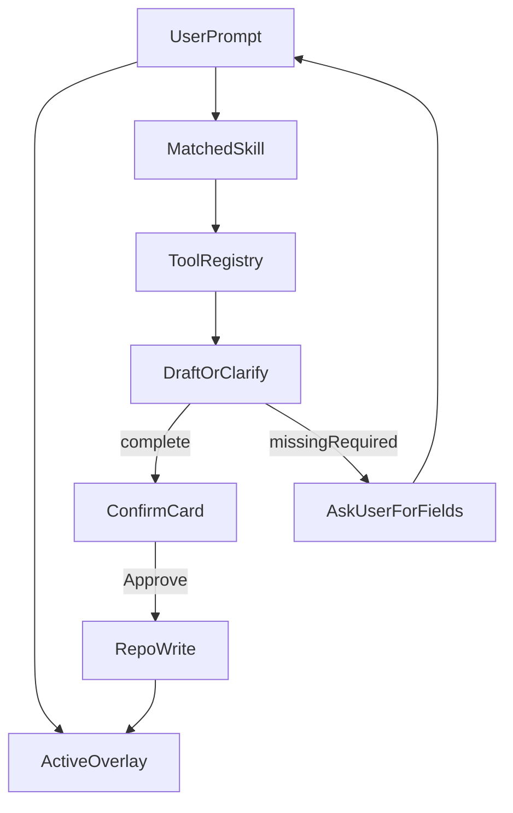

# Chat Skills and Overlays

Runtime catalog for the in-app Finance Copilot. This is **not** the repo’s Cursor/Claude `.agents/skills` — those guide coding agents. These packs guide the **Chat section** inside Notable Finance App.

Canonical architecture: [`chat-agent-design.md`](chat-agent-design.md).

**Status:** Phase **6.6** — skills + overlays + Apple/on-device read-only gates documented and covered by Vitest hardening suite.

## Concepts

| Term | Meaning |
| --- | --- |
| **Tool** | Allow-listed main-process function (query / propose create|update). Executes against SQLite via existing domain validation. |
| **Skill** | Named workflow playbook: when to use which tools, required fields, clarification policy, and success copy hooks. Skills do **not** bypass tools or confirmation. |
| **Overlay** | Tone / register pack applied to assistant text (and optional heuristic amplifications). Overlays never change amounts, never approve writes, never enable delete. |
| **Slash mode** | User-selected overlay (e.g. `/roast`) that sticks for the turn or until changed. |

**Rule:** Skills shape *procedure*; overlays shape *voice*; tools shape *truth and mutation*.

---

## Skills catalog

Each skill lists: trigger intent, tools used, required vs optional fields, clarify behavior, and notes. Field sets must match the same rules as the UI forms (`getExpenseConditionalSections`, workflow fixed categories).

### Skill: `ask-data`

**Purpose:** Answer questions from local finance data.

**Triggers:** “how much”, “summary”, “what’s left”, “list my…”, “compare…”, budget questions.

**Tools:** `getDashboardSummary`, `queryIncomes`, `queryExpenses` (with `viewMode`), `getCategoryBudgetStatus`, `getMonthlyMonitoringSnapshot`, `listAccounts`, category list tools.

**Required:** Enough scope to answer (month/view/category) — if missing, ask once (“Which month?” / “All accounts or GCash only?”).

**Writes:** None.

**Overlay hooks:** Budget overrun → tipid paalala; healthy surplus → light cheer if not `/strict`.

---

### Skill: `ask-app`

**Purpose:** Explain how the app / Notion workflows work.

**Triggers:** “how does Transfer work?”, “what is Pasabuy?”, “difference between Soft and Hard delete?”

**Tools:** `explainAppTopic`.

**Required:** Topic identity (clarify if vague).

**Writes:** None. Must state that Chat cannot delete.

---

### Skill: `monitoring-summary`

**Purpose:** Give a **Monthly Monitoring summary** for a specific **month and year** (e.g. July 2026, `2026-07`), grounded in local SQLite via the same reporting path as the Monthly Monitoring page.

**Triggers:** “monitoring summary”, “monthly monitoring for…”, “how was July 2026?”, “summary for 2026-07”, “paano ang monitoring ng [month] [year]”, “breakdown for last month”.

**Tools (read-only):** `getMonthlyMonitoringSnapshot(month)` (month as `YYYY-MM`), plus as needed `getDashboardSummary(month)`, `getCategoryBudgetStatus`, income/expense query tools scoped to that month.

**Writes / propose tools:** **None.**

**Required:** Target month+year. Resolve relative phrases (“last month”, “this month”) in main using the same date helpers as the UI; if ambiguous, ask once (“Which month and year?”).

**Response should cover (when data exists):**

- Month label (`YYYY-MM` / friendly name)
- Income / expense / net (or equivalent monitoring metrics the app already computes)
- Category budget vs spending highlights (over / under / on track)
- Notable flags (e.g. many unpaid items) only if cheap to derive from existing tools — no invented Notion formulas

**Clarify if missing:** Month and year when not stated or not resolvable.

**Overlay hooks:** `/strict` for numeric tables; `/roast` if several categories over budget; `/default` for a short Taglish wrap-up.

**Example:**

> User: Give me the monitoring summary for July 2026  
> Assistant: Loads `2026-07` snapshot → income/expense/net + budget highlights → no write actions.

---

### Skill: `rebudget` (chat-only, no writes)

**Purpose:** Help the user **think through rebudgeting** for the current month (or a named month): keep the **same total budget envelope**, suggest how to redistribute amounts across expense categories. **Advice and discussion only — no mutations.**

**Triggers:** “rebudget”, “reallocate budget”, “same budget but move from X to Y”, “paano ko i-shuffle ang budget”, “redistribute without increasing total”.

**Tools (read-only):** `getMonthlyMonitoringSnapshot(month)`, `getCategoryBudgetStatus` / category list + spending vs budget for the month, `getDashboardSummary` as needed.

**Writes / propose tools:** **None.** Do not call `propose*` for monitoring, categories, or expenses. Do not offer an Approve card that would change budgets.

**Behavior:**

1. Load current category budgets and spend for the target month.
2. Confirm the **total budget sum** stays fixed unless the user explicitly asks to change the envelope (if they ask to raise/lower total, explain that this skill only reshuffles **same total**; changing totals is out of scope for Chat v1 / point them to Monthly Monitoring UI if product allows edits there).
3. Produce a clear proposed allocation table (category → old budget → suggested budget → delta) that **sums to the same total**.
4. Call out categories already overspent vs suggested cuts/adds.
5. End with: this is a plan only — apply it yourself in **Monthly Monitoring** (or wherever budgets are maintained); Chat will not write it.

**Clarify if missing:** Which month? (default: current / selected workspace month). Any categories that must stay fixed (e.g. “huwag galawin Rent”)?

**Overlay hooks:** `/strict` for clean tables; `/roast` if they’re trying to fund discretionary while essentials are underfunded; `/cheer` when the plan protects savings/Alkansya.

**Example:**

> User: Rebudget this month — same total, less Food, more Transportation  
> Assistant: Shows current totals, proposes Food −2k / Transport +2k (sum unchanged), warns if Food is already overspent, reminds user to apply in Monitoring — no Approve write.

---

### Skill: `log-income`

**Purpose:** Propose a normal income create (not workflow categories).

**Triggers:** “add income”, “log salary”, “incoming…”.

**Tools:** `listAccounts`, `listIncomeCategories` (normal only — exclude auxiliary: IOU, Transfer, Old Income Logger, Credit Card Payment, Debt Payment), `proposeCreateIncome`.

**Base required fields:**

| Field | Notes |
| --- | --- |
| Name | Title / description |
| Date | Absolute or relative → resolved in main |
| Gross Income | Amount |
| Accounts | Non-credit active account when required by domain |
| Categories | Normal income category only |

**Optional:** Capital Expenditure.

**Forbidden on this skill:** `Transacted Account`, `CC Payment Covered` (transaction-only; use workflow skills).

**Clarify if missing:** Ask for each missing required field before or instead of a premature confirm card. Partial draft may show `status: needs_input` with empty slots.

**Overlay hooks:** Large income → celebrate (“Grabe paldo!”) after Approve.

---

### Skill: `log-expense-base`

**Purpose:** Propose a standard expense (cash/wallet/debit — no CC-only fields, no Pasabuy).

**Triggers:** “log expense”, “spent…”, “bayad sa…”, food/dating/etc. with non-credit account.

**Tools:** `listAccounts`, `listExpenseCategories`, `getCategoryBudgetStatus`, `proposeCreateExpense` with profile `base`.

**Base required fields:**

| Field | Notes |
| --- | --- |
| Purchase description | Name/title |
| Purchase Date | |
| Accounts | Resolved account |
| Categories | Non-Pasabuy unless user intends Pasabuy skill |
| Expense Amount | |

**Optional:** Date Paid (if omitted, unpaid / to-pay semantics may apply per domain).

**Conditional:** If resolved account is credit-like → hand off to `log-expense-cc`. If category is Pasabuy → hand off to `log-expense-pasabuy`.

**Clarify if missing:** Same as income — do not invent account/category; ask.

**Overlay hooks:** Dating keywords → cheer; large amount → tipid; over budget → paalala after tool check.

---

### Skill: `log-expense-cc`

**Purpose:** Expense against **Credit Account / BYPL / BNPL / e-Credit** (credit-like), including CC transaction fields.

**Triggers:** Explicit credit account, “CC purchase”, “swiped…”, Unpaid CC / Installments context.

**Tools:** Same lists + `proposeCreateExpense` with profile `creditCard: true`.

**Inherits base required fields**, plus when credit profile is active:

| Field | Required? | Notes |
| --- | --- | --- |
| Payment Status | Often required for meaningful CC logging | Paid / Unpaid / … |
| Interest | Optional | |
| Payment Frequency | When installments | |
| Period count | When installments | |
| Paid period | When partial progress | |
| CC Link Payment Receipt | Optional relation | |

Computed (never user-editable via chat): Gross Price, Installment Amount, Paid Amount, Remaining Balance, Expected payment date — shown on confirm card as read-only after domain calc.

**Clarify if missing:** If user says “CC na 5k sa SM” without status/frequency and installments are implied, ask: “Paid or Unpaid? One-time or installments?”

---

### Skill: `log-expense-pasabuy`

**Purpose:** Pasabuy-category expense with Pasabuy field set.

**Triggers:** “pasabuy”, Unpaid Pasabuy view, Pasabuy category name.

**Tools:** `proposeCreateExpense` with profile `pasabuy: true`.

**Inherits base required**, plus:

| Field | Required? | Notes |
| --- | --- | --- |
| Pasabuyer | Yes for create | Who owes / counterpart |
| Pasabuy Status | Yes when tracking | |
| Pasabuy Date of Payment | When status implies payment | |
| Pasabuy Account Receiver | When money received | |
| Pasabuy paid period | Optional | |

Computed read-only on card: Pasabuy Received Amount, Pasabuyer Balance.

**Clarify if missing:** “Sino ang Pasabuyer?” / “What’s the Pasabuy status?” before Approve is enabled.

---

### Skill: `edit-income` / `edit-expense`

**Purpose:** Propose updates to existing rows (single or mass).

**Triggers:** “change…”, “update…”, “set date paid…”, “mark as paid…”.

**Tools:** `query*` to find candidates → `proposeUpdate*` / `proposeMassUpdate*`.

**Required:** Stable target id(s) or unique filter; if ambiguous, list matches and ask which.

**Mass:** Cap N; batch confirm; never delete via “clear” wording — refuse destructive clears of rows.

**Clarify:** Missing patch fields → ask what to change.

---

### Skill: `workflow-transfer`

**Purpose:** Transfer workflow create/edit (Incomes-backed, category fixed to `Transfer`).

**In scope for Phase 6 writes:** **Yes** (propose + confirm).

**Triggers:** “transfer”, “move money from X to Y”.

**Tools:** `proposeCreateTransfer` / update variant; account lists **non-credit only**.

**Required:** Date, amount (gross), Source Account, Transfer Account (Transacted Account), category locked Transfer.

**Clarify:** Both accounts required; reject credit accounts with explanation.

---

### Skill: `workflow-cc-payment`

**Purpose:** Credit Card Payment workflow (category fixed `Credit Card Payment`).

**In scope for Phase 6 writes:** **Yes** (propose + confirm) — included with the other workflows.

**Triggers:** “pay my CC”, “bayad credit”, “CC payment”.

**Tools:** `proposeCreateCcPayment` / update variant.

**Required:** Date, amount, CC Account (credit-like), Payer Account (non-credit), category locked.

**Optional / when applicable:** CC Payment Covered linkage fields per domain.

**Clarify:** Missing payer or CC account → ask.

---

### Skill: `workflow-alkansya`

**Purpose:** Alkansya / savings logging (category fixed per product — e.g. `Savings`; amount treatment per app rules, including negative representation if still in effect).

**In scope for Phase 6 writes:** **Yes** (propose + confirm) — included with the other workflows.

**Triggers:** “alkansya”, “savings set aside”, “mag-ipon”.

**Tools:** `proposeCreateAlkansya` / update variant.

**Required:** Date, amount, account(s) per Alkansya form.

**Clarify:** Incomplete → ask; do not invent savings account.

---

### Skill: `workflow-receivables`

**Purpose:** Receivables / IOU-style workflow when backed by income transaction fields.

**In scope for Phase 6 writes:** **Yes** (propose + confirm).

**Triggers:** “receivable”, “utang sa akin”, “IOU collect”.

**Tools:** `proposeCreateReceivable` / update variant.

**Required:** Per receivables form (date, amount, accounts / counterparty fields as product defines).

**Clarify:** Counterparty / account gaps → ask.

---

### Workflow skills — inclusion summary

| Skill | In Phase 6 Chat? | Mutates on Approve? |
| --- | --- | --- |
| `workflow-transfer` | Yes | Yes (after confirm) |
| `workflow-cc-payment` | **Yes** | Yes (after confirm) |
| `workflow-alkansya` | **Yes** | Yes (after confirm) |
| `workflow-receivables` | Yes | Yes (after confirm) |
| `rebudget` | Yes | **No** — chat plan only |
| `monitoring-summary` | Yes | **No** — read-only report |

---

### Skill: `refuse-delete`

**Purpose:** Hard stop for any **finance record** destructive intent.

**Triggers:** delete, remove, soft delete, hard delete, trash, archive, “burahin”, “tanggalin ang record” (when aimed at incomes/expenses/accounts/etc.).

**Tools:** None. Orchestrator short-circuits before propose tools.

**Response:** Refuse clearly; point user to Income/Expense UI delete controls; never offer a finance-delete confirm card.

**Not this skill:** Deleting a **chat conversation** / clearing chat history is a normal Chat UI action (ChatGPT-style) and is allowed — see [`chat-agent-design.md`](chat-agent-design.md).

**Overlay:** May use `/strict` tone even if `/roast` is active — no joking about deleting money history.

---

### Skill: `clarify-required`

**Purpose:** Meta-skill when any log/edit skill detects `missingRequired[]`.

**Behavior:**

1. Do **not** call `chat:confirm` approve path.
2. Emit assistant message listing missing fields in plain language (Taglish OK unless `/strict`).
3. Optionally show an incomplete draft card with disabled Approve and highlighted empties.
4. Wait for user reply; merge answers into the draft; re-validate; repeat until complete or Cancel.

**Example:**

> User: Log expense, 300 pesos, yesterday, dating  
> Missing: account, category (if dating isn’t a category match)  
> Assistant: “Saan account ito galing, at anong expense category? (Dating keywords ko lang so far.)”

---

## Overlays catalog

Overlays are prompt fragments + optional post-processors. They compose with skills.

### Overlay: `default`

- Warm Taglish, short sentences.
- Light humor only after successful Approve or on harmless Q&A.
- Never fabricate balances.

**Sample after income approve:** “Added it. Grabe paldo!”  
**Sample after big expense approve:** “Okay na, naka-lista. Ang gastos mo naman — magtipid ka nga!”

---

### Overlay: `roast` (`/roast`)

- Sarcastic tipid coach.
- Amplifies large discretionary spends and budget overruns.
- Still accurate; roast the *habit*, not the user’s identity.

**Sample over budget:** “Ayan ka na naman — lumalagpas ka na. Paalala: 20k lang budget mo sa Food!”

---

### Overlay: `cheer` (`/cheer`)

- Affirming, celebratory.
- Dating / self-care keywords bias here unless `/roast` or `/strict`.

**Sample:** “Dasurv mo yan.” / “Good call — logged.”

---

### Overlay: `strict` (`/strict`)

- No slang, no jokes.
- Numbers, field names, ISO dates.
- Ideal for audits and mass edits.

**Sample:** “Draft ready: expense 300.00 PHP; purchaseDate 2026-07-22. Approve to save.”

---

### Overlay: `quiet` (`/quiet`)

- Minimal acknowledgments: “Logged.” / “Cancelled.” / “Need account.”

---

### Overlay: `budget-guard` (automatic, composable)

Not a slash mode — always available as a post-tool hook when `getCategoryBudgetStatus` / propose expense reports overrun.

- Injects paalala with **real** budget and category from tools.
- Stacks with `/roast` (stronger) or `/strict` (neutral warning).

---

### Overlay: `keyword-cheer` (automatic)

Keywords (non-exhaustive): dating, date night, anniversary, self-care, reward.

- Bias reply toward `/cheer` unless user forced `/roast` or `/strict`.
- Does not skip required-field clarification.

---

### Overlay: `income-celebrate` (automatic)

When approved income gross ≥ configurable threshold (settings later; design default e.g. ₱10,000).

- “Grabe paldo!”-class lines under `default`/`cheer`.
- Silent under `/quiet`; factual under `/strict`.

---

### Overlay: `spend-wince` (automatic)

When approved expense amount ≥ threshold OR category over budget.

- Tipid jab under `default`/`roast`.
- Warning only under `/strict`.

---

## Composition matrix

| Situation | Skill | Overlay stack |
| --- | --- | --- |
| “Summary Food May” | `ask-data` | `default` or active slash |
| “Monitoring summary for July 2026” | `monitoring-summary` | `/strict` optional for tables |
| “Rebudget same total, cut Food, add Transport” | `rebudget` | `/strict` good for tables; **no write** |
| “Transfer 1k GCash → Maya” incomplete | `workflow-transfer` + `clarify-required` | active slash |
| “Pay 10k to BPI CC from Maya” | `workflow-cc-payment` | active slash |
| “Alkansya 2k to Maya savings” | `workflow-alkansya` | + `income-celebrate`-like cheer optional |
| “CC 5k Uniqlo 3 months” | `log-expense-cc` | + `budget-guard` if needed |
| “Pasabuy 2k for Ana” | `log-expense-pasabuy` | clarify Pasabuyer/status if missing |
| “Delete that expense” | `refuse-delete` | prefer clear/`strict` |
| “Dating dinner 300 yesterday” missing account | `log-expense-base` + `clarify-required` | `keyword-cheer` after approve |
| Mass “mark these paid” | `edit-expense` | prefer `/strict` suggestion in UI |

---

## Implementation notes (when coding)

- Ship skills/overlays as versioned JSON or TS modules under e.g. `src/main/chat/skills/` and `src/main/chat/overlays/`.
- Orchestrator picks skill via model tool choice **or** light intent router; overlays via slash parse + heuristics.
- Unit-test: missing required → no write; CC profile fields appear only for credit-like accounts; Pasabuy only for Pasabuy; delete intent never registers a draft; workflow categories locked.
- Keep this doc updated when field taxonomy changes ([`../shared/notion-field-mapping.md`](../shared/notion-field-mapping.md), product expense rules).
