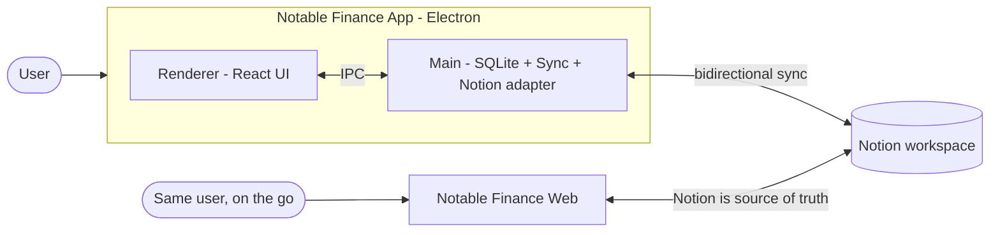
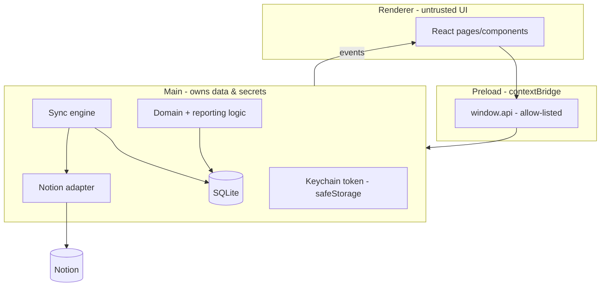
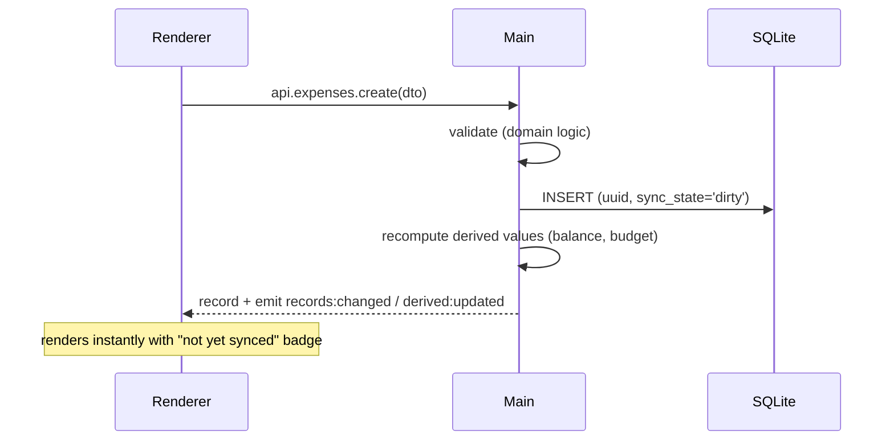
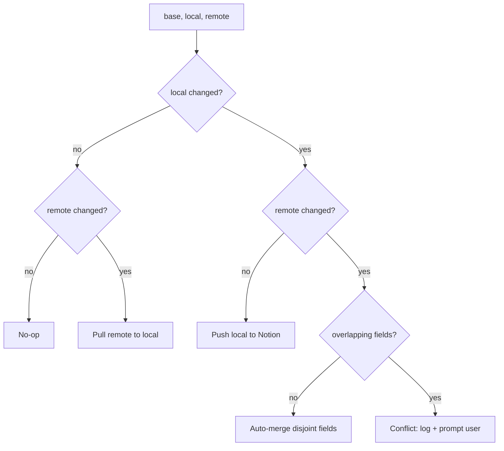
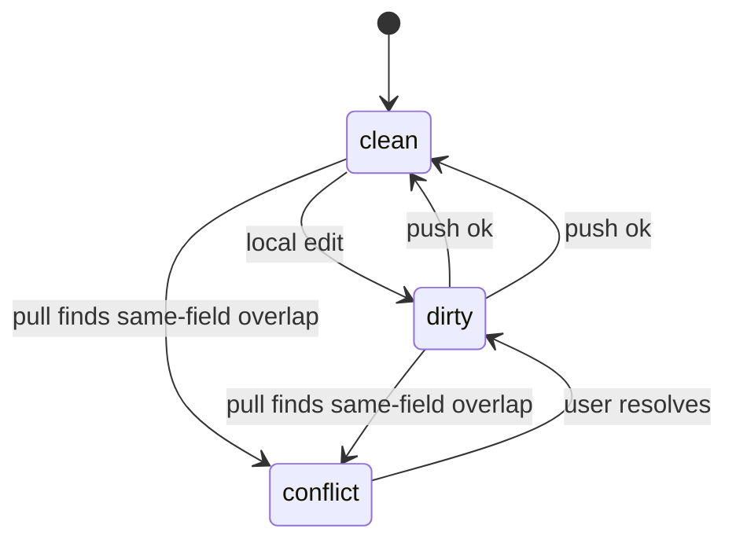

# Desktop Diagrams

Mermaid diagrams for the desktop app. (Render in any Mermaid-aware Markdown viewer.)

## Context



## Process model & data ownership



## Local write (instant, offline)



## Sync pass (push then pull)

```mermaid
sequenceDiagram
  participant M as Main (sync engine)
  participant N as Notion
  participant DB as SQLite
  Note over M: PUSH
  M->>DB: select dirty records
  loop each dirty
    M->>N: create/update page (writable fields only)
    N-->>M: page id + last_edited_time
    M->>DB: base_snapshot=writable; sync_state='clean'
  end
  Note over M: PULL
  M->>N: Search changed since last_pull_cursor
  N-->>M: changed pages
  loop each changed
    M->>DB: find by notion_page_id
    alt not found
      M->>DB: INSERT new local record
    else found
      M->>M: three-way merge (base/local/remote)
    end
  end
  M->>DB: recompute derived; advance cursor
  M-->>M: emit sync:status / sync:conflict
```

## Three-way merge decision



## Per-record sync state


