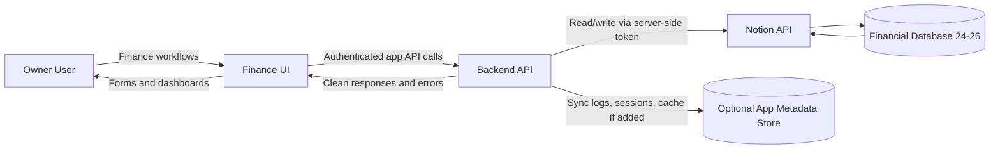

# Context Diagram

## Boundary Notes

- Notion is the source of truth for finance records.
- Accounts and Categories are Notion-maintained reference/configuration data in the app.
- Monthly Monitoring is shown in the app as a read-focused monitoring section, with selected-month values calculated from scoped Income and Expense records.
- The browser never receives the Notion token.
- The backend is the trust boundary for validation, mapping, and sync.
- App metadata storage supports sessions if needed, cache snapshots, pending mutations, conflicts, audit events, and sync logs, but not canonical finance records.
