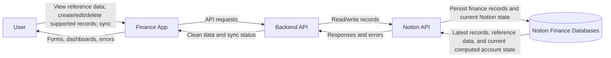
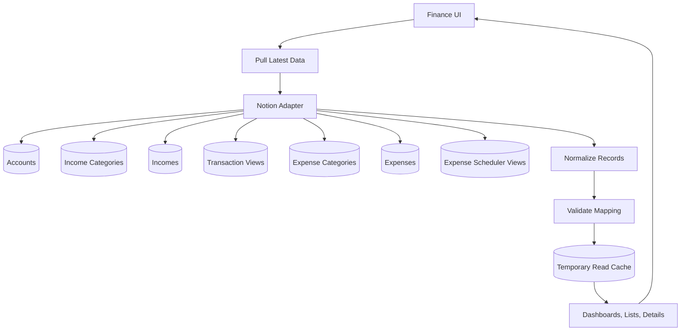
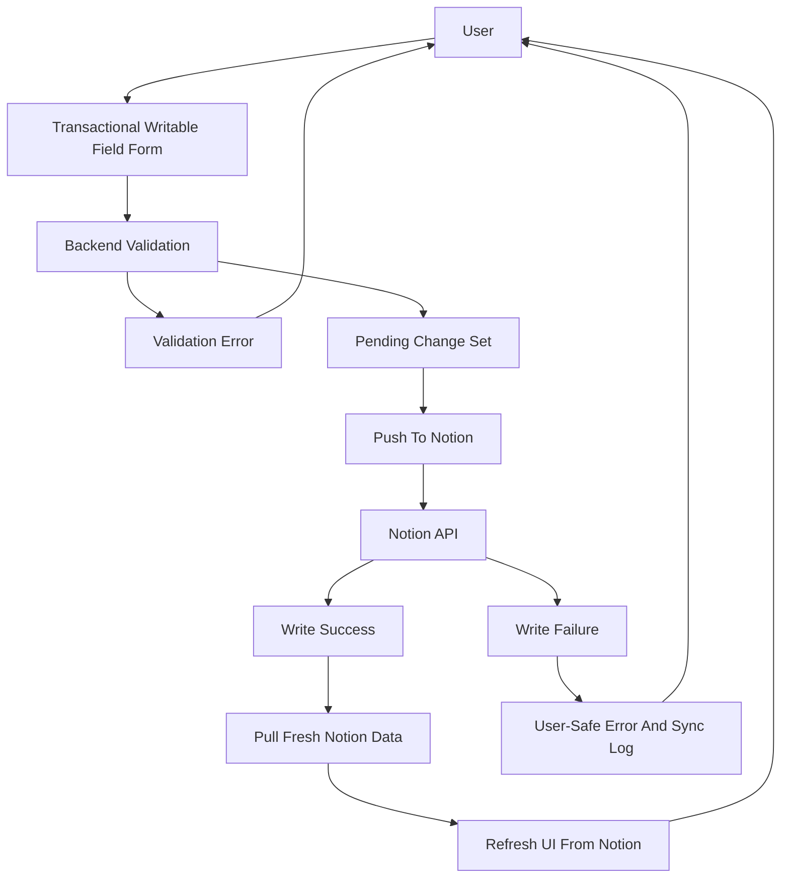

# Data Flow Diagram

## Scope

The app is a finance UI and sync layer. Notion remains the source of truth.

## Level 0

## Level 1: Pull And View

## Level 1: Mutation Sync

## Data Stores

| Store | Canonical? | Purpose |
| --- | --- | --- |
| Notion finance databases | Yes | Accounts and categories as reference/configuration data; incomes, transactions through income views, expenses, and expense scheduler through expense views |
| Temporary read cache | No | Faster UI rendering and post-sync refresh |
| Pending changes | No | Holds user changes until commit |
| Sync logs/audit logs | No | Operational troubleshooting and user feedback |
| Session/auth store | No | Access control if implemented |

## Sensitive Boundaries

- Browser/frontend boundary: no Notion token.
- Backend boundary: validates input and owns Notion token use.
- Notion boundary: canonical persistence and computed values.
- Reporting boundary: selected-month Dashboard, Monthly Monitoring, and category metrics are calculated by app/shared logic from scoped records, not from Notion category or Monthly Monitoring formulas.
- Logs boundary: no raw secrets or unnecessary sensitive finance payloads.
