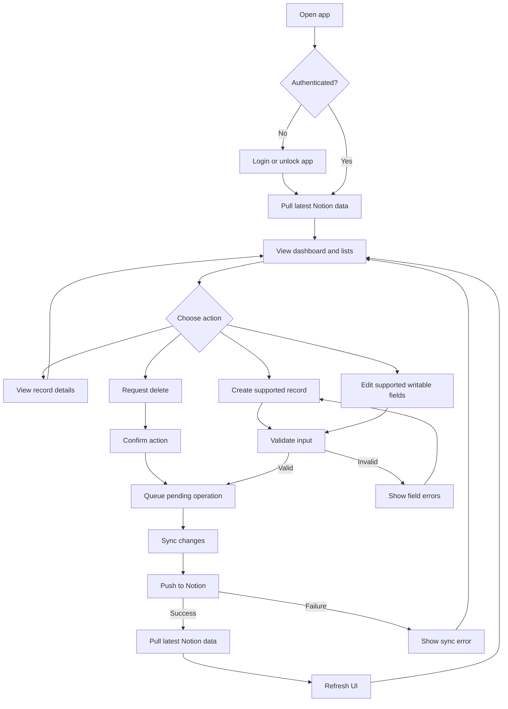

# User Flow Diagram

## Main Finance Workflow

## Form Rule

Forms show writable fields only. Computed fields from Notion appear in detail, list, or dashboard views as read-only values.

Forms are for supported transactional records only. Accounts, Income Categories, and Expense Categories are maintained in Notion and appear in the app as reference/configuration data.

Normal Income forms show only income-related fields and hide transaction-only fields such as `Transacted Account`. Expense forms adapt to the selected account, category, and view so credit-card and Pasabuy fields appear only when relevant.

## Sync Rule

The successful ending state is not "local form saved." The successful ending state is "Notion accepted the change, latest Notion data was pulled, and the UI refreshed from that data."
