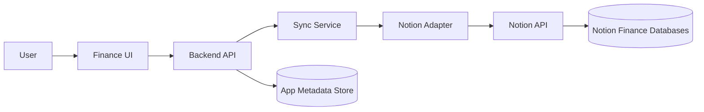

# Technical Design Document

## Project Goal

Build a finance UI application where Notion remains the source of truth. The app acts as an encoding, viewing, validation, and sync layer for these Notion-backed workflows:

- Accounts
- Income Categories
- Incomes
- Transactions
- Expense Categories
- Expenses
- Expense Scheduler
- Monthly Monitoring

Users can create, edit, delete, view, and sync supported records through the app. Monthly Monitoring is shown as a read-focused monitoring section. The app hides computation-heavy Notion fields from normal user forms and refreshes its UI from Notion after sync.

## Current Planning Status

This repository is in documentation and planning mode. No application source code should be created yet.

The official stack is Next.js for the frontend and NestJS for the backend.

Create real Next.js and NestJS application code only when the user explicitly asks to implement.

## Source Of Truth

Notion is the canonical finance data store. The app will include metadata storage from the start for sync logs, pending operations, conflicts, audit events, sessions if needed, and cached snapshots. PostgreSQL is the durable metadata store, with Neon Free as the planned provider while the app remains within free-tier limits. Redis may be added as a supporting cache, rate-limit store, short-lived session helper, or queue coordination layer if implementation needs it. Supporting stores must not become the canonical financial database unless a later architecture decision explicitly changes that rule.

## System Boundary

The frontend talks to the backend only. The backend owns Notion API access, validation, schema mapping, error normalization, and sync behavior.

## Architecture Principles

- Keep Notion integration server-side.
- Centralize Notion database IDs and property mappings.
- Classify every field as writable, read-only, computed, hidden, or out of scope.
- Reject writes to formula, rollup, reverse relation, and system-managed properties.
- Validate user input before writing to Notion.
- Support both direct-save form submissions and explicit queued changes through a Sync button.
- After a successful mutation or sync commit, pull fresh Notion data before considering the UI current.
- Preserve live Notion select labels exactly in canonical mapping docs. The UI may use context-friendly labels when they remain obvious and close to the original Notion meaning.
- Prefer small, focused modules by finance domain.

## Proposed Runtime Shape

The selected stack is Next.js plus NestJS. The expected shape is:

- `application/`: web UI for forms, tables, dashboards, sync status, and settings.
- `service/`: backend API, Notion adapter, validation, sync orchestration, email/Google auth, and health checks.
- `shared/`: shared types, DTOs, schema definitions, enums, and field maps.
- `tests/`: automated and manual verification assets.

Use Next.js for the UI and NestJS for the backend.

## Notion Database Mapping

| App Entity | Notion Data Source | Data Source ID |
| --- | --- | --- |
| Accounts | Accounts '25 | `2893edac-dc7a-4d42-a890-80f5b0490549` |
| Income Categories | Income Categories '25 | `11a77f65-247b-417a-bd8f-1c95417a88ff` |
| Incomes | Incomes '25 | `d29d9b37-8b7a-42ff-ba4d-ff4d875d74ef` |
| Transactions | View of Incomes '25 | `d29d9b37-8b7a-42ff-ba4d-ff4d875d74ef` |
| Expense Categories | Expense Categories '25 | `2aff8687-0cc5-4630-97d6-1658532b584c` |
| Expenses | Expenses '25 | `d55c679f-5db7-4938-be9d-ceb147ad8d3d` |
| Expense Scheduler | View of Expenses '25 | `d55c679f-5db7-4938-be9d-ceb147ad8d3d` |
| Monthly Monitoring | Monthly Monitoring DB '25 | `9be2188b-4e29-47a2-88da-a2ba420cae12`; read-focused app section |

Database IDs must be configured outside source code through backend environment/configuration. Do not expose them as frontend secrets.

## Field Classification

| Class | Meaning | App Behavior |
| --- | --- | --- |
| Writable | User/app can create or update this Notion property | Show in relevant forms |
| Read-only | App can display but should not update | Show in details, tables, dashboards |
| Computed | Formula, rollup, reverse relation, Notion-managed, or derived value | Display only, never submit in writes |
| Hidden | Internal, technical, or advanced field | Hide from normal UI |
| Out of scope | Not used by initial app scope | Do not expose |

## Core Writable Field Summary

### Accounts

Writable fields: `Account Name`, `Account Type`, `Account Information`, `Starting Balance`, `Credit Limit`, `Credit Points`, `Annual Fee`, `Billing Day`, `Due Day`, `Inactive`, `Income Label`, `Expense Label`, `Balance Label`.

Computed/read-only examples: `Current Balance`, `Available Limit`, `Total Expenses`, `Total Incomes`, `Total CC, Debt & Transfer`, `Total Credit Interest`, `Total Pasabuy`.

Default account lists should show active accounts only by filtering out records where `Inactive` is set. The UI should support gallery/card and table views. Account forms should adapt to `Account Type`; credit-specific fields such as `Credit Limit`, `Credit Points`, `Annual Fee`, `Billing Day`, and `Due Day` should be shown only for applicable types, especially `Credit Account` and `BYPL`.

### Income Categories

Writable fields: `Source of Income`.

Read-only/computed examples: `Monthly Earnings`, `Monthly Expenditure`, `Monthly Gross Earnings`, `Monthly Net Income`, `Earning Percentage`, relation rollups.

### Incomes

Writable fields: `Name`, `Date`, `Gross Income`, `Capital Expenditure`, `Accounts`, `Categories`, `Transacted Account`, `CC Payment Covered`.

Computed/read-only examples: `Net Income`, `Transaction Amount`, `Monthly Capital Expenditure Sorter`, `Monthly Net Sorter`, `Monthly Gross Sorter`, `Sum of CC Covered Overview`.

Normal Income forms should expose only income-related fields: `Name`, `Date`, `Gross Income`, `Capital Expenditure`, `Accounts`, and `Categories`. Do not show `Transacted Account` or `CC Payment Covered` in the normal add-income flow. Income supports Daily, Weekly, Monthly, and Annually views, plus frontend-only Account and Categories filters.

Normal Income category choices must exclude auxiliary workflow categories. Current Notion evidence shows these auxiliary labels: `IOU`, `Transfer`, `Old Income Logger`, `Credit Card Payment`, and `Debt Payment`.

Delete behavior: update `Name` to `Original Name [Deleted: 1234.56]` using the current `Gross Income` value, then clear `Gross Income`.

### Transactions

Transactions are app workflows backed by the Incomes data source and Transaction views, including transfer, credit card payment, debt payment, receivable, Alkansya, and related transaction records. Use the same writable/computed field rules and delete behavior as Incomes.

Transfer is a Monthly workflow where the category is fixed to `Transfer` and cannot be changed. It includes the transaction account field.

Credit Card Payment is a Monthly workflow where the category is fixed to `Credit Card Payment` and cannot be changed. It includes the transacted/payment-through account field needed by the Notion views.

Alkansya and Receivables are Monthly transaction-style workflows. Treat them as Incomes-backed workflows unless implementation discovery proves a different backing store is required.

### Expense Categories

Writable fields: `Categories`, `Monthly Budget`, `Upcoming Budget`, `Auxiliary`.

Computed/read-only examples: `Expenses`, `Spending`, `Remaining`, `Overview`, `Total Overview`, `Rollup of Specific Monthly Spending`, `Total Overall Monthly Expense`.

### Expenses

Writable fields: `Purchase description`, `Purchase Date`, `Date Paid`, `Custom end range`, `Expense Amount`, `Interest`, `Accounts`, `Categories`, `Payment Status`, `Payment Frequency`, `Period count`, `Paid period`, `CC Link Payment Receipt`, `Pasabuyer`, `Pasabuy Status`, `Pasabuy paid period`, `Pasabuy Date of Payment`, `Pasabuy Account Receiver`.

Computed/read-only examples: `Gross Price`, `Installment Amount`, `Paid Amount`, `Remaining Balance`, `Monthly Total`, `Expected payment date`, `Extracted Billing Day`, `Extracted Due Day`, `Pasabuy Received Amount`, `Pasabuyer Balance`.

Expense supports Daily, Weekly, Monthly, Annually, Pasabuy, To pay, To buy, Installments, and CC Transactions views. Account and Categories filters are frontend-only unless implementation later needs backend pagination support.

Expense forms should adapt to selected category, account, and view. Credit-card fields appear only when the selected account is `Credit Account` or `BYPL`. Pasabuy fields appear only when the Pasabuy view/category is selected.

Delete behavior: update `Purchase description` to `Original Name [Deleted: 1234.56]` using the current `Expense Amount` value, then clear `Expense Amount`.

### Expense Scheduler

Expense Scheduler is an app workflow backed by the Expenses data source and Expense Scheduler views, including to-buy, to-pay, installment, scheduled expense, and related payment workflows. Use the same writable/computed field rules and delete behavior as Expenses.

### Monthly Monitoring

Monthly Monitoring is a read-focused app section. It includes category budget context and income category context from Notion relations. It should show computed month-level values, but should not create, edit, or delete Monthly Monitoring records through normal app flows.

## Sync Design

The app supports two sync entry points:

- Direct-save forms: a form submit immediately sends the create/edit/delete operation to the backend.
- Queued Sync button: the UI can collect pending operations and commit them together through an explicit sync action.

Both sync entry points use the same backend validation, Notion write, pull-latest, and UI refresh rules.

The primary sync sequence is:

1. Pull latest data from Notion.
2. Normalize Notion records into app DTOs.
3. Display simplified UI.
4. User creates, edits, or requests delete.
5. Backend validates the pending operation.
6. Backend writes the operation to Notion.
7. Backend pulls fresh data from Notion.
8. Frontend refreshes from the fresh snapshot.

The app must not assume that a local mutation result is final until Notion has been re-read.

The UI should provide a schema verification button after the Notion integration key is configured. That button should call the backend schema-status capability and report whether required databases, fields, relation targets, and select/status options are available.

## Delete Policy

- Incomes: update `Name` to `Original Name [Deleted: 1234.56]` using the current `Gross Income` value, then clear `Gross Income`.
- Expenses: update `Purchase description` to `Original Name [Deleted: 1234.56]` using the current `Expense Amount` value, then clear `Expense Amount`.
- Transactions: follow the Incomes delete behavior because they are backed by the Incomes data source.
- Expense Scheduler records: follow the Expenses delete behavior because they are backed by the Expenses data source.
- Income Categories and Expense Categories: delete the category records.
- Accounts: mark the account inactive by setting `Inactive`; do not physically delete account records.

## Conflict And Schema Drift Handling

The backend should detect:

- A record changed in Notion after the app loaded it.
- A mapped Notion property is missing.
- A mapped property type changed.
- A relation target is not shared with the integration.
- A select option expected by validation is missing.

User-facing errors should name the affected database/property and suggest a clear next action.

## Security Constraints

- Notion tokens stay server-side only.
- Authentication should support email sign-in and Google sign-in.
- Never put Notion secrets in frontend code, browser storage, logs, or public config.
- Validate all write inputs in the backend.
- Limit frontend writes to known writable fields.
- Redact sensitive financial payloads from production logs.
- Use least-privilege Notion integration access and share only required databases with the integration.

## Quality Expectations

When implementation starts, verification should include:

- Unit tests for field mappers, validation rules, and sync state handling.
- Integration tests for backend API behavior with mocked Notion responses.
- Contract tests for API request/response shapes.
- E2E tests for create/edit/delete/sync workflows.
- Manual tests against a non-production Notion workspace before touching real financial data.

Recommended test tooling after scaffolding:

- Vitest for unit tests in shared logic and frontend-friendly modules.
- React Testing Library for frontend component behavior.
- Jest or Vitest for NestJS service unit tests, depending on scaffold defaults.
- Supertest for backend HTTP integration tests.
- Playwright for end-to-end workflows.
- ESLint and TypeScript checks for linting and type safety.

## Out Of Scope

- Implementing app code during this planning task.
- Bank integrations and payment execution.
- Editing Notion formulas, rollups, or database schema through normal UI.
- Treating an app database as the finance source of truth.
- Real-time Notion collaboration semantics.
- Creating, editing, or deleting Monthly Monitoring records through normal app screens.

## Open Questions

- How should the app handle Notion records created outside the app while a local draft is pending?
