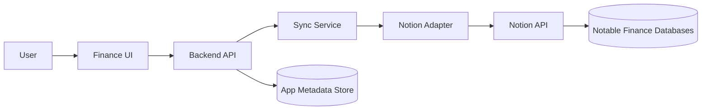

# Technical Design Document

## Project Goal

Build a finance UI application where Notion remains the source of truth. The app acts as an encoding, viewing, validation, and sync layer for these Notion-backed workflows:

- Accounts
- Income Categories
- Incomes
- Transactions
- Expense Categories
- Expenses
- Expense Scheduler
- Monthly Monitoring

Users can create, edit, delete, view, and sync supported transactional records through the app. Accounts, Income Categories, and Expense Categories are queried as Notion-maintained reference/configuration data and are not created, edited, or deleted in the app. Monthly Monitoring is shown as a read-focused monitoring section. The app hides computation-heavy Notion fields from normal user forms and refreshes its UI from Notion after sync.

## Current Implementation Status

Frontend and backend implementation have started after explicit implementation requests. The `application/` folder contains the first Next.js workspace foundation. The `service/` folder contains the first NestJS backend foundation with route modules, field mapping, mutation validation, a Notion adapter boundary, sync orchestration over a development repository, schema-status reporting, and backend tests.

The official stack is Next.js for the frontend and NestJS for the backend.

Create or expand real Next.js and NestJS application code only when the user explicitly asks to implement that scope. Backend live Notion writes and PostgreSQL persistence still require integration credentials, live schema confirmation, and implementation hardening.

## Source Of Truth

Notion is the canonical finance data store. The app will include metadata storage from the start for sync logs, pending operations, conflicts, audit events, sessions if needed, and cached snapshots. PostgreSQL is the durable metadata store, with Neon Free as the planned provider while the app remains within free-tier limits. Redis may be added as a supporting cache, rate-limit store, short-lived session helper, or queue coordination layer if implementation needs it. Supporting stores must not become the canonical financial database unless a later architecture decision explicitly changes that rule.

## System Boundary

The frontend talks to the backend only. The backend owns Notion API access, validation, schema mapping, error normalization, and sync behavior.

## Architecture Principles

- Keep Notion integration server-side.
- Centralize Notion database IDs and property mappings.
- Classify every field as writable, read-only, computed, hidden, or out of scope.
- Reject writes to formula, rollup, reverse relation, and system-managed properties.
- Validate user input before writing to Notion.
- Support both direct-save form submissions and explicit queued changes through a Sync button.
- After a successful mutation or sync commit, pull fresh Notion data before considering the UI current.
- Query only the Notion records needed for the active view/scope. Accounts are always fetched as current read-only reference data; Income and Expense records are fetched by active view and date scope instead of loading every resource together.
- Use app/shared calculation functions for selectable-month Dashboard, Monthly Monitoring, and category reporting. Do not rely on Notion Monthly Monitoring, Income Category, or Expense Category formulas/rollups as historical reporting APIs.
- Preserve live Notion select labels exactly in canonical mapping docs. The UI may use context-friendly labels when they remain obvious and close to the original Notion meaning.
- Prefer small, focused modules by finance domain.

## Proposed Runtime Shape

The selected stack is Next.js plus NestJS. The expected shape is:

- `application/`: web UI for forms, tables, dashboards, sync status, and settings.
- `service/`: backend API, Notion adapter, validation, sync orchestration, email/Google auth, and health checks.
- `shared/`: shared types, DTOs, schema definitions, enums, and field maps.
- `tests/`: automated and manual verification assets.

Use Next.js for the UI and NestJS for the backend.

## Notion Database Mapping

| App Entity | Notion Data Source | Data Source ID |
| --- | --- | --- |
| Accounts | Accounts '25 | `2893edac-dc7a-4d42-a890-80f5b0490549` |
| Income Categories | Income Categories '25 | `11a77f65-247b-417a-bd8f-1c95417a88ff` |
| Incomes | Incomes '25 | `d29d9b37-8b7a-42ff-ba4d-ff4d875d74ef` |
| Transactions | View of Incomes '25 | `d29d9b37-8b7a-42ff-ba4d-ff4d875d74ef` |
| Expense Categories | Expense Categories '25 | `2aff8687-0cc5-4630-97d6-1658532b584c` |
| Expenses | Expenses '25 | `d55c679f-5db7-4938-be9d-ceb147ad8d3d` |
| Expense Scheduler | View of Expenses '25 | `d55c679f-5db7-4938-be9d-ceb147ad8d3d` |
| Monthly Monitoring | Monthly Monitoring DB '25 | `9be2188b-4e29-47a2-88da-a2ba420cae12`; read-focused app section |

Database IDs must be configured outside source code through backend environment/configuration. Do not expose them as frontend secrets.

## Field Classification

| Class | Meaning | App Behavior |
| --- | --- | --- |
| Writable | User/app can create or update this Notion property | Show in relevant forms |
| Read-only | App can display but should not update | Show in details, tables, dashboards |
| Computed | Formula, rollup, reverse relation, Notion-managed, or derived value | Display only, never submit in writes |
| Hidden | Internal, technical, or advanced field | Hide from normal UI |
| Out of scope | Not used by initial app scope | Do not expose |

## Core Writable Field Summary

### Accounts

Notion-maintained fields: `Account Name`, `Account Type`, `Account Information`, `Starting Balance`, `Credit Limit`, `Credit Points`, `Annual Fee`, `Billing Day`, `Due Day`, `Inactive`, `Income Label`, `Expense Label`, `Balance Label`.

Computed/read-only examples: `Current Balance`, `Available Limit`, `Total Expenses`, `Total Incomes`, `Total CC, Debt & Transfer`, `Total Credit Interest`, `Total Pasabuy`.

Default account lists should show active accounts only by filtering out records where `Inactive` is set. The UI should support gallery/card and table views. The app should not expose account create, edit, or delete actions; account maintenance happens directly in Notion. The month selector should not appear on Accounts because the app does not need account balance snapshots by month.

### Income Categories

Notion-maintained fields: `Source of Income`.

Read-only/computed examples: `Monthly Earnings`, `Monthly Expenditure`, `Monthly Gross Earnings`, `Monthly Net Income`, `Earning Percentage`, relation rollups.

The app should query Income Category IDs and names for dropdowns, filters, and category mapping only. It should not expose income category create, edit, or delete actions. It should not use Income Category formula/rollup values for selectable-month reporting; earnings, gross, net, expenditure, and percentage values should be calculated from scoped Income records.

### Incomes

Writable fields: `Name`, `Date`, `Gross Income`, `Capital Expenditure`, `Accounts`, `Categories`, `Transacted Account`, `CC Payment Covered`.

Computed/read-only examples: `Net Income`, `Transaction Amount`, `Monthly Capital Expenditure Sorter`, `Monthly Net Sorter`, `Monthly Gross Sorter`, `Sum of CC Covered Overview`.

Normal Income forms should expose only income-related fields: `Name`, `Date`, `Gross Income`, `Capital Expenditure`, `Accounts`, and `Categories`. Do not show `Transacted Account` or `CC Payment Covered` in the normal add-income flow. Income supports Daily, Weekly, Monthly, and Annually views. The month selector appears only for Monthly view. Daily, Weekly, and Annually are anchored to the current date/current period.

Income queries should load only the records needed for the active view. Monthly view defaults to the current month and queries another `YYYY-MM` only when the month selector is used. Account and category filters apply to the scoped result set.

The app should calculate `Net Income` from `Gross Income - Capital Expenditure` for normal Income logs instead of relying on the Notion formula value. `Transaction Amount` is a database calculation helper and should stay hidden from normal Income and transaction-style UI views.

Normal Income category choices must exclude auxiliary workflow categories. Current Notion evidence shows these auxiliary labels: `IOU`, `Transfer`, `Old Income Logger`, `Credit Card Payment`, and `Debt Payment`.

Delete behavior: update `Name` to `Original Name [Deleted: 1234.56]` using the current `Gross Income` value, then clear `Gross Income`.

### Transactions

Transactions are app workflows backed by the Incomes data source and Transaction views, including transfer, credit card payment, debt payment, receivable, Alkansya, and related transaction records. Use the same writable/computed field rules and delete behavior as Incomes.

Transfer is a Monthly workflow where the category is fixed to `Transfer` and cannot be changed. It shows `Source Account` and `Transfer Account`, and both account selectors should include non-credit accounts only.

Credit Card Payment is a Monthly workflow where the category is fixed to `Credit Card Payment` and cannot be changed. It shows `CC Account` for credit-like accounts (`Credit Account` and `BYPL`) and `Payer Account` for non-credit payment sources such as wallets, savings, cash, and debit accounts.

Alkansya is a Monthly transaction-style workflow whose category is fixed to `Savings`. Until the accumulated-money treatment is finalized, Alkansya amounts should be represented as negative values so they do not inflate total accumulated money.

Receivables are normal Income-style records that have not been received yet. They use the same visible fields as normal Income forms. A record remains in Receivables while no receiving account is selected; once a receiving account is selected, it should move into normal Income logs.

### Expense Categories

Notion-maintained fields: `Categories`, `Monthly Budget`, `Upcoming Budget`, `Auxiliary`.

Computed/read-only examples: `Expenses`, `Spending`, `Remaining`, `Overview`, `Total Overview`, `Rollup of Specific Monthly Spending`, `Total Overall Monthly Expense`. `Total Overview` is the category spending share over total expense, expressed as a percentage.

The app should query Expense Category IDs, names, `Auxiliary`, `Monthly Budget`, and `Upcoming Budget` for dropdowns, filters, and budget mapping. It should not expose expense category create, edit, or delete actions. It should not use Expense Category formula/rollup values for selectable-month reporting; spending, remaining, overview, total overview, and category shares should be calculated from scoped Expense records plus Notion-maintained budget config.

### Expenses

Writable fields: `Purchase description`, `Purchase Date`, `Date Paid`, `Custom end range`, `Expense Amount`, `Interest`, `Accounts`, `Categories`, `Payment Status`, `Payment Frequency`, `Period count`, `Paid period`, `CC Link Payment Receipt`, `Pasabuyer`, `Pasabuy Status`, `Pasabuy paid period`, `Pasabuy Date of Payment`, `Pasabuy Account Receiver`.

Computed/read-only examples: `Gross Price`, `Installment Amount`, `Paid Amount`, `Remaining Balance`, `Monthly Total`, `Expected payment date`, `Extracted Billing Day`, `Extracted Due Day`, `Pasabuy Received Amount`, `Pasabuyer Balance`.

Expense supports Daily, Weekly, Monthly, Unpaid Pasabuy, To pay, To buy, Installments, and CC Transactions views. Annually is intentionally out of Expense scope. Monthly Expense reporting uses `Purchase Date` as the month anchor. The month selector appears only for Monthly view; other Expense views use their own current-period or outstanding-workflow scopes. Account and Categories filters apply to the scoped result set in general Expense views. Category filtering should support All, W/out Pasabuy, and specific-category options. The Unpaid Pasabuy view is already scoped to Pasabuy category records, so the category filter should be hidden/ignored; it includes Pasabuy records where `Date Paid` is empty or `Pasabuy Status` is not `Payment fully received`, and it can be narrowed by `Pasabuyer`.

Expense queries should load only the records needed for the active view. Monthly view defaults to the current month and queries another `YYYY-MM` only when the month selector is used.

Expense table views should show `Date`, `Description`, `Amount`, `Account`, `Category`, `Date Paid`, and `Expense Status`. `Expense Status` is a local UI indicator, not a Notion field: empty `Date Paid` shows a red circle, and a populated `Date Paid` shows a green circle.

Expense forms should adapt to selected category, account, and view. Base expense fields are `Purchase description`, `Purchase Date`, `Accounts`, `Categories`, `Expense Amount`, and `Date Paid`. Credit-card fields appear only when the selected account is `Credit Account` or `BYPL` and include payment status, interest, payment frequency, period count, paid period, and app-calculated gross price, installment amount, paid amount, remaining balance, and expected payment date. Pasabuy fields appear only when the Unpaid Pasabuy view/category is selected and include `Pasabuyer`, `Pasabuy Status`, `Pasabuy Date of Payment`, `Pasabuy Account Receiver`, `Pasabuy paid period`, and app-calculated `Pasabuy Received Amount` and `Pasabuyer Balance`.

Navigation chrome should avoid repeating the current section title in the top bar. The sidebar should support an icon-only collapsed state; when collapsed, hover or focus temporarily reveals full labels without changing the persisted collapsed state. Transaction workflow tables should show full `Date` values instead of month-only labels; the month selector only defines query scope.

Formula ownership rule: selectable-month Dashboard, Monthly Monitoring, Income, Expense, and category reporting should be calculated in app/shared source code from scoped Notion records. Notion formulas/rollups from Monthly Monitoring, Income Categories, and Expense Categories are not the source for historical selected-month reporting. Current Account computed values may still be displayed as read-only Notion-backed account state.

Delete behavior: update `Purchase description` to `Original Name [Deleted: 1234.56]` using the current `Expense Amount` value, then clear `Expense Amount`.

### Expense Scheduler

Expense Scheduler is an app workflow backed by the Expenses data source and Expense Scheduler views, including to-buy, to-pay, installment, scheduled expense, and related payment workflows. Use the same writable/computed field rules and delete behavior as Expenses.

### Monthly Monitoring

Monthly Monitoring is a read-focused app section. It should show app-calculated month-level values for the selected month, including monthly income, gross income, monthly expense, gross margin, needs, wants, savings, and category breakdowns. Income records use `Date` as their month anchor. Expense records use `Purchase Date` as their month anchor. Category names and budget config come from Notion category records, but computed category metrics are calculated in the app. Normal app flows should not create, edit, or delete Monthly Monitoring records, and the Notion Monthly Monitoring database should not be treated as the historical reporting source.

## Sync Design

The app supports two sync entry points:

- Direct-save forms: a form submit immediately sends the create/edit/delete operation to the backend.
- Queued Sync button: the UI can collect pending operations and commit them together through an explicit sync action.

Both sync entry points use the same backend validation, Notion write, pull-latest, and UI refresh rules.

The primary sync sequence is:

1. Pull latest data from Notion.
2. Normalize Notion records into app DTOs.
3. Display simplified UI.
4. User creates, edits, or requests delete.
5. Backend validates the pending operation.
6. Backend writes the operation to Notion.
7. Backend pulls fresh data from Notion.
8. Frontend refreshes from the fresh snapshot.

The app must not assume that a local mutation result is final until Notion has been re-read.

The UI should provide a schema verification button after the Notion integration key is configured. That button should call the backend schema-status capability and report whether required databases, fields, relation targets, and select/status options are available.

## Delete Policy

- Incomes: update `Name` to `Original Name [Deleted: 1234.56]` using the current `Gross Income` value, then clear `Gross Income`.
- Expenses: update `Purchase description` to `Original Name [Deleted: 1234.56]` using the current `Expense Amount` value, then clear `Expense Amount`.
- Transactions: follow the Incomes delete behavior because they are backed by the Incomes data source.
- Expense Scheduler records: follow the Expenses delete behavior because they are backed by the Expenses data source.
- Accounts, Income Categories, and Expense Categories: no app delete flow; maintenance happens in Notion.

## Conflict And Schema Drift Handling

The backend should detect:

- A record changed in Notion after the app loaded it.
- A mapped Notion property is missing.
- A mapped property type changed.
- A relation target is not shared with the integration.
- A select option expected by validation is missing.

User-facing errors should name the affected database/property and suggest a clear next action.

## Security Constraints

- Notion tokens stay server-side only.
- Authentication should support email sign-in and Google sign-in.
- Never put Notion secrets in frontend code, browser storage, logs, or public config.
- Validate all write inputs in the backend.
- Limit frontend writes to known writable fields.
- Redact sensitive financial payloads from production logs.
- Use least-privilege Notion integration access and share only required databases with the integration.

## Quality Expectations

When implementation starts, verification should include:

- Unit tests for field mappers, validation rules, and sync state handling.
- Integration tests for backend API behavior with mocked Notion responses.
- Contract tests for API request/response shapes.
- E2E tests for create/edit/delete/sync workflows.
- Manual tests against a non-production Notion workspace before touching real financial data.

Recommended test tooling after scaffolding:

- Vitest for unit tests in shared logic and frontend-friendly modules.
- React Testing Library for frontend component behavior.
- Jest or Vitest for NestJS service unit tests, depending on scaffold defaults.
- Supertest for backend HTTP integration tests.
- Playwright for end-to-end workflows.
- ESLint and TypeScript checks for linting and type safety.

## Out Of Scope

- Treating the current mock frontend data as canonical finance data.
- Bank integrations and payment execution.
- Editing Notion formulas, rollups, or database schema through normal UI.
- Creating, editing, or deleting Accounts, Income Categories, or Expense Categories through normal UI.
- Treating an app database as the finance source of truth.
- Real-time Notion collaboration semantics.
- Creating, editing, or deleting Monthly Monitoring records through normal app screens.

## Open Questions

- How should the app handle Notion records created outside the app while a local draft is pending?
